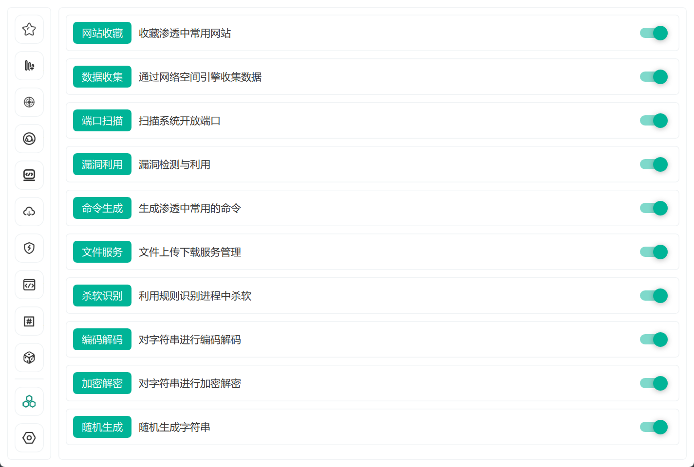
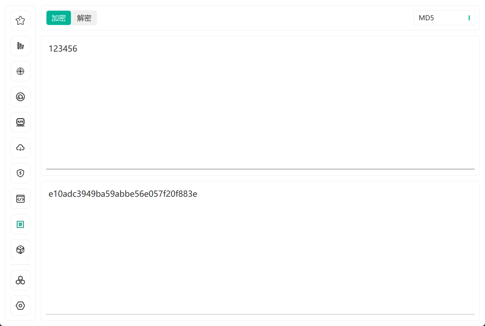
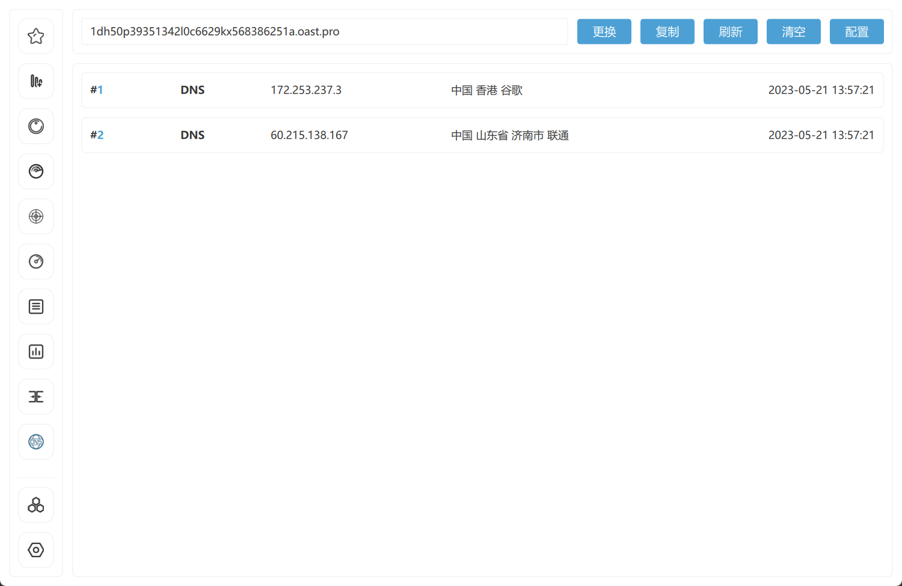
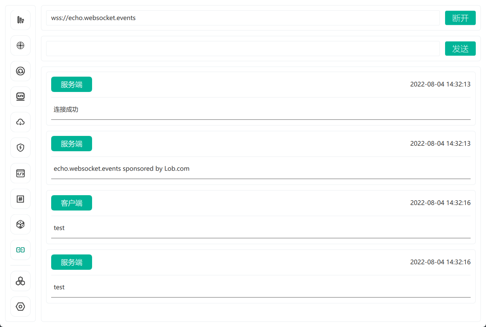
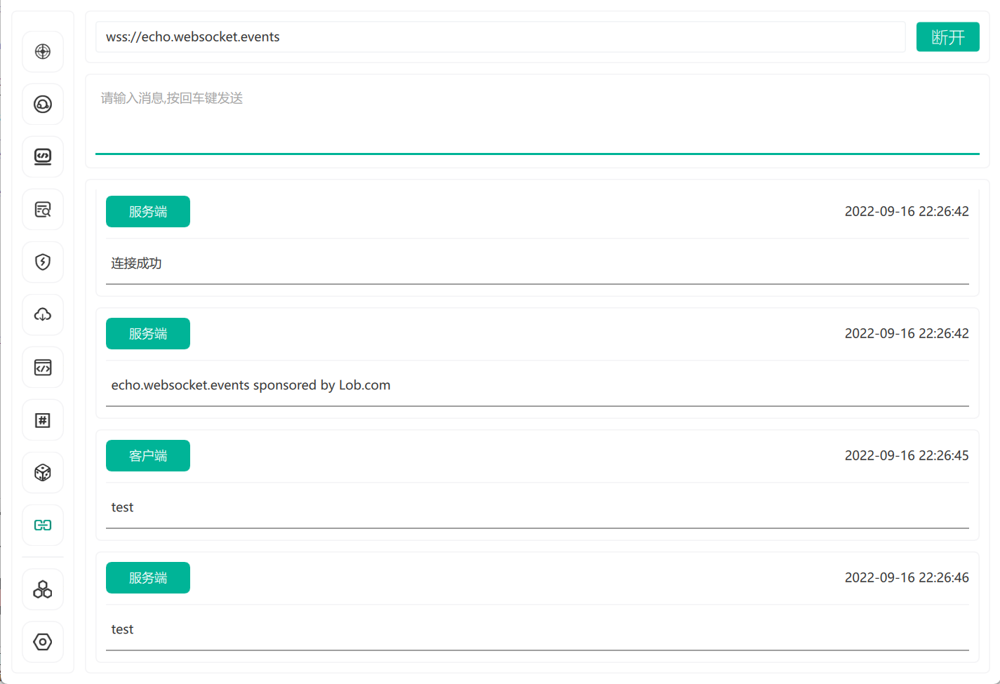

<h1 align="center">AuxTools</h1>

## 项目简介
图形化渗透测试工具

## 使用示例
### 模块管理

### 网站收藏

### 数据收集

### 端口扫描

### 漏洞利用
需配合我的另一个项目Polaris一起使用, 具体使用方法如下:      
1.运行Polaris项目下的Server脚本, 启动web服务   
```
python Server.py -port=8080 -auth=password
```
2.打开程序, 启用漏洞利用模块, 填写接口地址和认证密码 

### 命令生成

### 口令查询

### 杀软识别

### 文件下载

### 编码解码  

### 加密解密

### 随机生成

### 即时通讯


## 问题列举
1. 在虚拟机里运行, 程序空白?   
    解决方法如下:   
    + 编辑虚拟机设置->显示器->3D图形->取消勾选3D加速图形

## 后续计划
[ ] 信息搜集模块   
[ ] 权限管理模块   
[ ] 口令爆破模块   
[ ] 免杀生成模块   

## 版本日志
[版本修改日志](docs/CHANGELOG.md)

## 使用声明
本工具仅用于安全测试目的   
用于非法用途与开发者无关     
