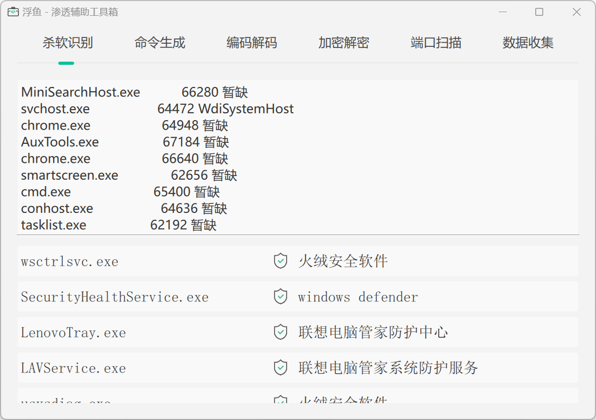
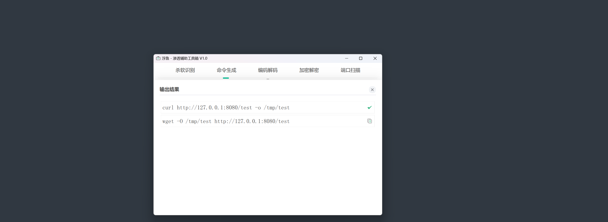
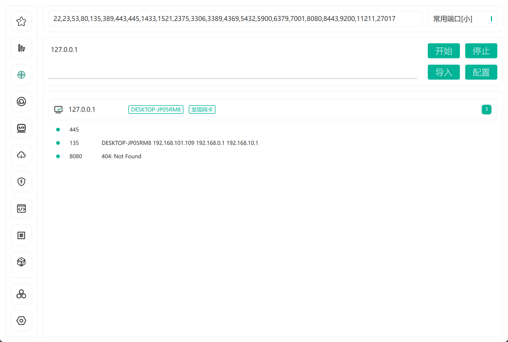
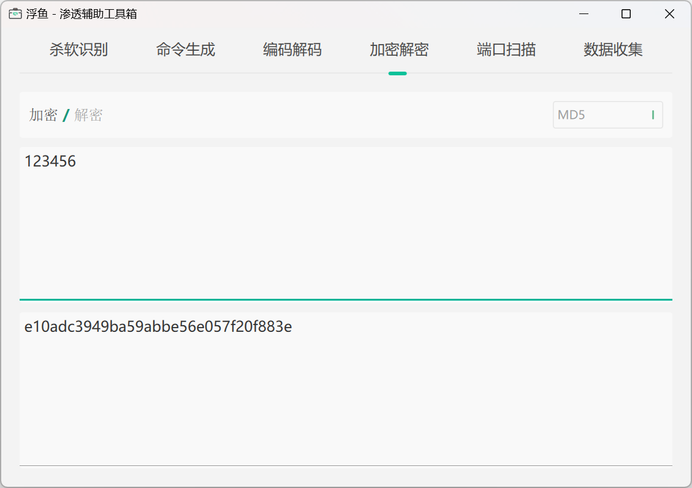
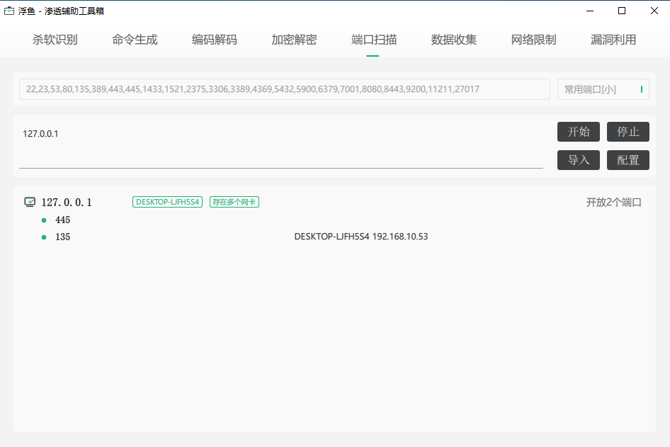
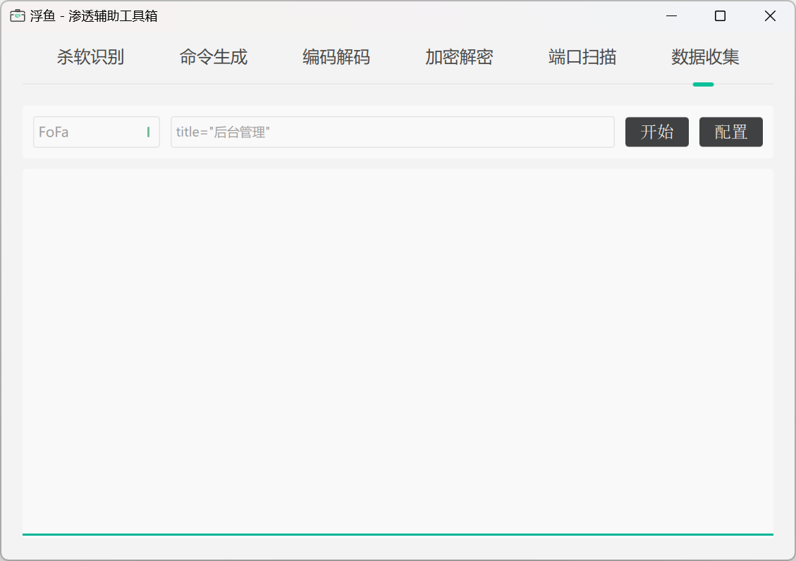
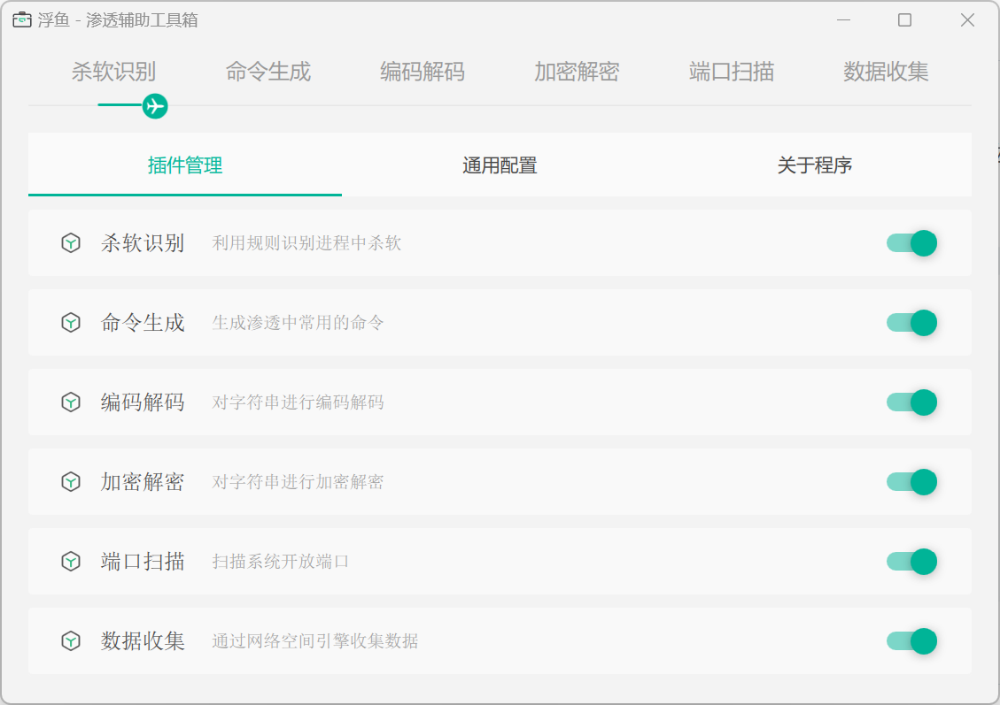
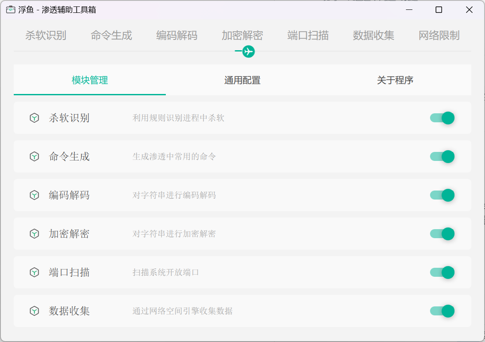

<h1 align="center">AuxTools</h1>

## 项目简介
图形化渗透辅助工具

## 使用示例
### 杀软识别

### 命令生成

### 编码解码

### 加密解密

### 端口扫描

### 数据收集

### 网络限制

### 控制中心

## 问题列举
1. 在虚拟机里运行, 程序空白?   
    解决方法如下:   
    + 如果是VMware, 打开VM虚拟机->菜单编辑->首选项->显示->图形->勾选远程虚拟机的硬件加速 选项; 如果打开还是白屏, 编辑虚拟机设置->显示器->3D图形->取消勾选3D加速图形
    + 如果是VirtualBox, 打开设置->显示->显卡->勾选3D加速选项

2. 程序报毒?   
原因是命令生成模块存储的命令被杀软检测到, 程序本身不存在任何恶意行为, 请师傅们放心食用   

3. 控制中心怎么打开?   
双击菜单下面的滑块即可打开(5分钟后会自动关闭哦)

## 版本日志
[版本修改日志](docs/CHANGELOG.md)

## 使用声明
本工具仅用于安全测试目的   
用于非法用途与开发者无关   
