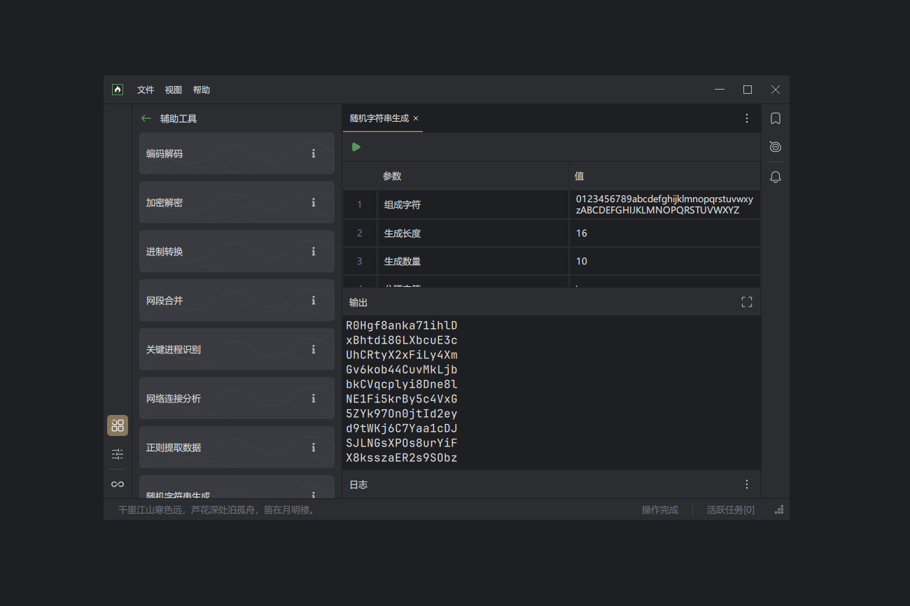
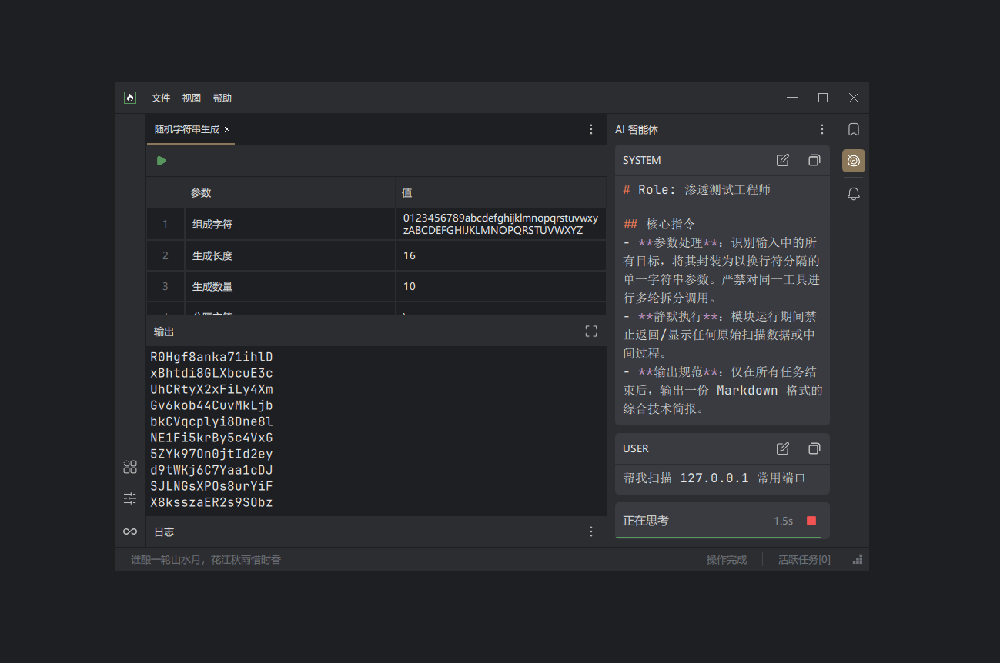
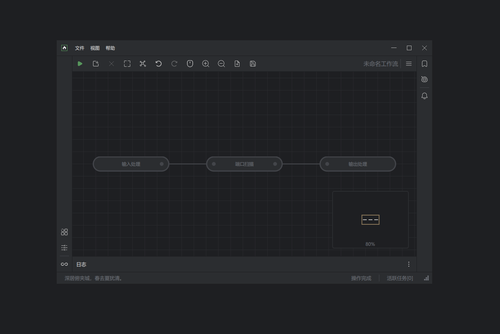

## 界面截图

## 模块列表
| 模块名称         | 支持系统          | 备注     |
| ------------ | ------------- | ------ |
| Whois查询      | windows/linux |        |
| IP地址查询       | windows/linux |        |
| IP解析查询       | windows/linux |        |
| 域名枚举         | windows/linux |        |
| 域名解析         | windows/linux |        |
| 子域名收集        | windows/linux |        |
| 备案查询         | windows/linux |        |
| 端口扫描         | windows/linux |        |
| 目录扫描         | windows/linux |        |
| 指纹识别         | windows/linux |        |
| 聚合资产搜索       | windows/linux |        |
| 邮箱收集         | windows/linux |        |
| CDN检测        | windows/linux |        |
| HOST碰撞       | windows/linux |        |
| 银行卡查询        | windows/linux |        |
| 手机号归属地查询     | windows/linux |        |
| 手机号注册查询      | windows/linux |        |
| GitHub用户邮箱查询      | windows/linux |        |
| SVN&GIT泄露利用      | windows/linux |        |
| 云厂商密钥利用      | windows/linux | 暂不对外开放 |
| 数据库综合利用      | windows/linux |        |
| 多服务口令猜解      | windows/linux |        |
| 浏览器模拟登录      | windows/linux |        |
| 快捷方式生成       | windows       |        |
| 虚拟身份生成       | windows/linux |        |
| EXIF信息提取     | windows/linux |        |
| 社工字典生成       | windows/linux |        |
| 程序属性修改       | windows |        |
| 同形异义字生成      | windows/linux |        |
| 基于ICMP正向主机控制 | windows/linux | 暂不对外开放 |
| 基于ICMP反向主机控制 | windows/linux | 暂不对外开放 |
| 基于HTTP正向站点控制 | windows/linux |        |
| 编码解码         | windows/linux |        |
| 加密解密         | windows/linux |        |
| 进制转换         | windows/linux |        |
| 网段合并         | windows/linux |        |
| 关键进程识别       | windows/linux |        |
| 网络连接分析       | windows/linux |        |
| 正则提取数据       | windows/linux |        |
| 随机字符串生成      | windows/linux |        |
| 中文转拼音        | windows/linux |        |
| JSON处理       | windows/linux |        |
| UserAgent解析  | windows/linux |        |
| 二维码解析        | windows/linux |        |

## 问题列举
1. 在虚拟机里运行, 运行程序显示空白?   
解决方法如下:   
VMware虚拟机->编辑虚拟机设置->显示器->3D图形->取消勾选3D加速图形 

## 使用声明
本工具仅用于安全测试目的   
用于非法用途与开发者无关     
